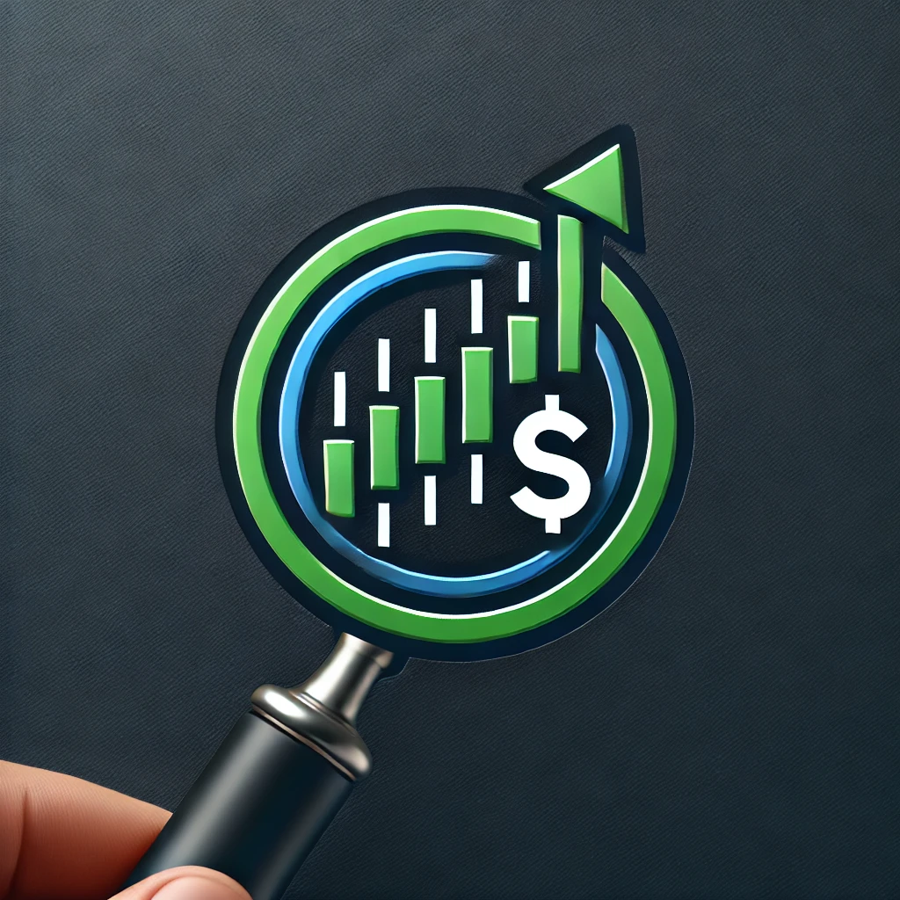

# Algo-Stock-Trader
Honors by Contract Term Project for Advance Software Applications for Economics. Use alpha advantage API and pandas to collect, organize, and analyze stock data. Then create a stock trading strategy based off this data collected.

## Project Breakdown
The project is divided into three parts, each worth 10 points:

### Data Collection:

Gather data on a stock of your choice from the 'Alphavantage API'.
Collect at least 1,000 data points (daily or intraday) and save them in a 'CSV file' to upload.
### Data Analysis:

Develop a trading strategy using the collected data.
Write a short paper (1-3 pages) in LaTeX, describing:
The stock you selected.
When to buy and sell based on your strategy.
Results of backtesting your strategy (e.g., returns on a $1 investment).
A graph showing your strategy's return over time.
Submit as a PDF.
### Programming:

Provide the Python code used to perform the analysis in Part 2.
Ensure it matches your data and analysis findings, so others can reproduce your results.

# Roadmap

Week 1: Setup and Data Collection
Task: Set up Alphavantage API access and decide on a stock.
Milestone: Collect and save 1,000 data points in a CSV file.

Week 2-3: Strategy Development and Backtesting
Task: Design a trading strategy using your data.
Milestone: Complete initial analysis and determine buy/sell points based on patterns or indicators.

Week 4: Writing the Analysis Report
Task: Write a LaTeX document for your strategy analysis.
Milestone: Complete draft, including analysis description, backtesting results, and return graph.

Week 5: Coding and Finalization
Task: Code the strategy in Python based on your analysis.
Milestone: Verify code consistency with your data and backtesting report.

Week 6: Submission
Task: Submit the CSV, LaTeX paper (PDF), and Python code on Blackboard.